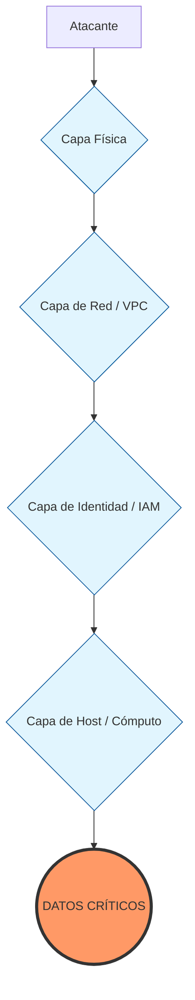

# 🛡️ Defensa en Profundidad (Defense in Depth) en la Nube

> **Perfil:** Analista de Seguridad Cloud / SysAdmin
> **Concepto:** Una estrategia de seguridad multinivel que no confía en una sola barrera. Si una capa falla, la siguiente debe contener la amenaza.

En **Cymbal Bank**, no ponemos solo un firewall y nos vamos a dormir. Aplicamos el concepto de "Capas de Cebolla". Como SysAdmin Linux, esto te resultará familiar, pero en la nube las capas son más dinámicas y programables.

---

## 🏛️ Las Capas de la Cebolla en Google Cloud

Imagina un atacante intentando llegar a tus datos en una instancia de Compute Engine. Debe atravesar estas capas:

### 1. Seguridad Física (La Fortaleza)
*   **Google's DC:** Biometría, cámaras, detectores de metales.
*   **Hardware:** Chip Titan y Secure Boot. No se puede ejecutar software manipulado en el "hierro".

### 2. Red (El Perímetro y la Microsegmentación)
*   **Capa Externa:** Cloud Armor (WAF) contra ataques DDoS y SQLi.
*   **VPC:** Redes aisladas sin IPs públicas (lo que hicimos en el Lab 17).
*   **Firewalls:** Reglas basadas en etiquetas (`target-tags`), no solo en IPs.

### 3. Identidad (El Nuevo Perímetro: IAM)
*   **Autenticación:** 2FA/MFA obligatorio.
*   **Autorización:** Roles de "Mínimo Privilegio". Incluso si alguien entra en la red, no puede borrar un bucket si su identidad no tiene ese permiso específico.

### 4. Cómputo / Host (Hardening de Linux)
*   **OS Login:** Gestión de SSH vinculada a la identidad de Google, no a llaves sueltas en el disco.
*   **Shielded VMs:** VMs que verifican la integridad del Kernel durante el arranque.
*   **Actualizaciones:** Parches automáticos y monitoreo de vulnerabilidades.

### 5. Datos (El Núcleo)
*   **Cifrado por Defecto:** AES-256 en reposo. Google cifra todo, pero tú puedes gestionar tus propias llaves (CMEK).
*   **DLP (Data Loss Prevention):** Herramientas que detectan si alguien intenta subir números de tarjeta de crédito a un lugar no seguro.

---

## 📊 Visualización del Modelo

---

## 🧠 Reflexión del Mentor: ¿Por qué es Vital?

> [!IMPORTANT]
> **El Fallo es Inevitable:** El principio de Defensa en Profundidad asume que **algún control fallará**. Un usuario puede caer en un phishing (falla la capa de Identidad), pero si tienes una buena segmentación de red (Firewall) y los datos están cifrados, el daño se contiene.
>
> **Tu Rol como Analista:** Tu trabajo es verificar que no hay "agujeros" directos que atraviesen todas las capas (ej: una VM con IP pública, sin firewall y con una cuenta de servicio con permisos de `Owner`). Eso es lo que llamamos una "Ruta de Exposición Crítica".

---
*Consolidado para el proyecto Google Cloud Security.*
